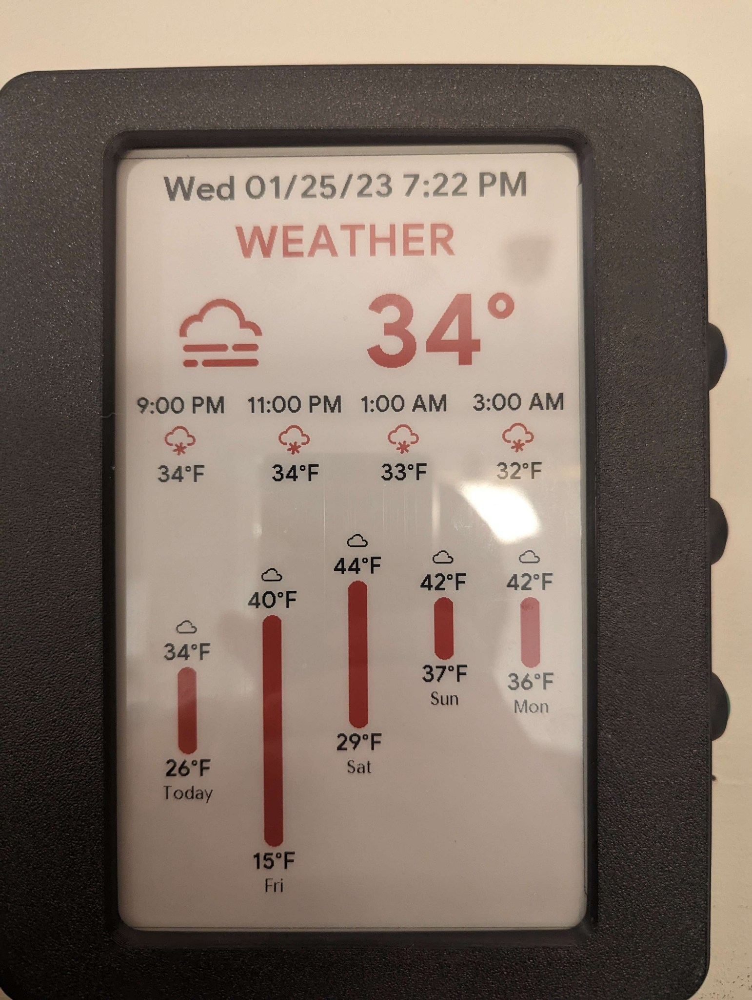
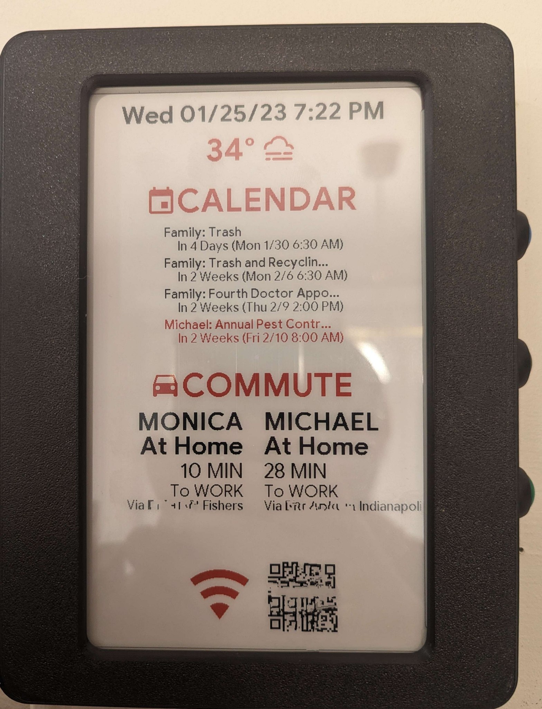

# Waveshare Display Configuration
For use with the Waveshare 7.5inch e-Paper B V2 display.



## Updates:
### Dec 7, 2023
* Updated display font sizes and colors
* Removed unnecessary ID and font size substitutions
* Moved to new HA Template entities
* Use new HA weather and calendar services, removed need for AppDaemon and ICS Calendar Sensor
* Added Baby Tab
* Added new scripts
* Buttons switch to specific page instead of going back/forth
* Various updates across the board - see commits
---

## Instructions:

### Notes:
This is not plug-and-play. It is likely that you will need to debug some things. It is presumed you know how to debug any issues or at least search for help.

All files were taken from my personal installation and adjusted so that they can work for others. If an issue is caused by a bug in my configurations or missing details, please raise an issue. If you are still running into issues, contact me on Discord or Reddit (@droans). 

While this is decently complicated as a whole, each individual piece (except for the is rather simple. 

---

###   Home Assistant

#####   You will need:
* Device trackers showing the location for two people
* ~~ICS Calendar Sensor custom component~~ No longer required
* Commute sensors for two people from current location to home and to work (preferably Waze)
* A Weather entity providing hourly, daily, and current temperature and conditions
* A personal and family calendar
* A Baby Buddy Instance (For Baby tab)
* An air quality sensor in the nursery providing Temperature, CO2, VOC, and PM Concentration (For Baby Tab)
* Baby Buddy Application and Baby Buddy HACS Integration

#####  Steps:

1. Install the Baby Buddy Integration.
2. Copy `hass-config/display.yaml` to your HA packages directory.
3. Use the instructions at the top of `display.yaml` to replace the variables with the proper values for your installation.
4. Restart Home Assistant and validate the sensors are working. 

---
###   ESPHome

1. Create a subdirectory for your device files and copy the files under `esphome-config` into that directory.
2. Update the data in `secrets.yaml` and each substitution file under `substitutions`. You do not need to update all of the substitutions. Instead, focus primarily on entities (generally labeled as `XXXX_ENTITY`), attributes (`XXXX_ATTR`), display, network and ESPHome configuration, and directory paths. Where possible, the important items are separated from the unimportant items. 
3. Create a `display.yaml` file (or however you would like to name it) in the root configuration directory for your ESPHome instance. Add the lines below into the file:

```
packages:
  config: !include display/config.yaml
```

3. Validate and install the configuration. 