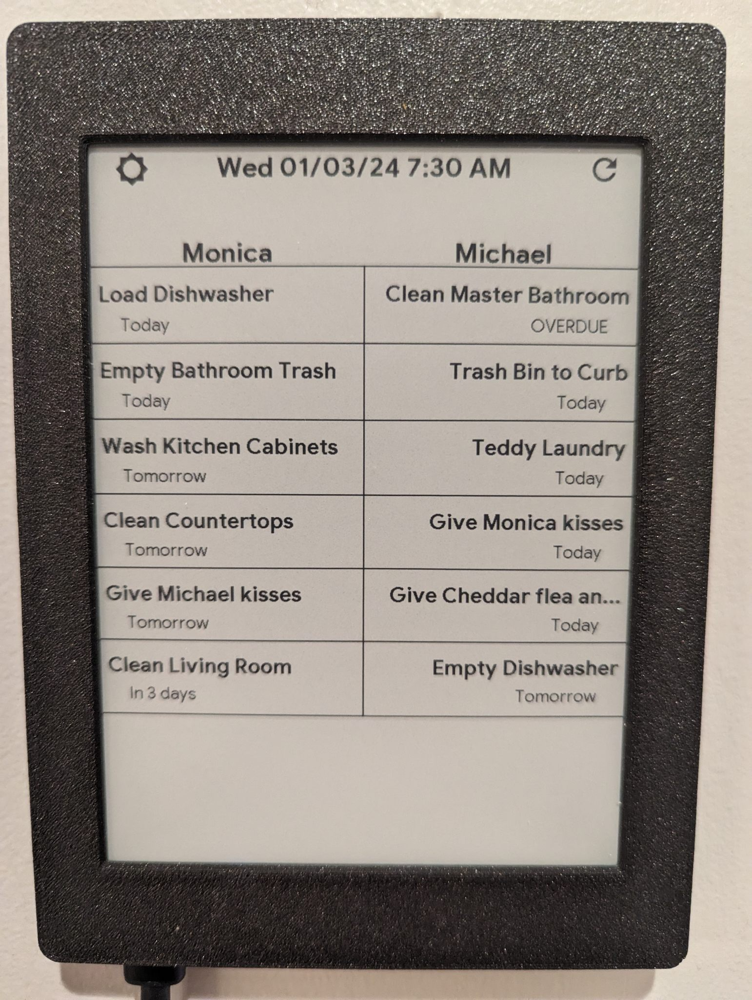
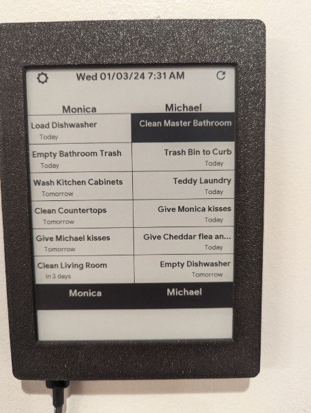

# Waveshare Information Display
For use with the Waveshare 7.5inch e-Paper B V2 display. Provides three different pages - Weather, Calendar and Traffic, and Baby feed and diaper change tracking. Uses ESPHome, Home Assistant, and Baby Buddy

 

# Inkplate 6 Plus Chores Display
Chore tracking for two people, including the ability to select and check off the chore. Uses ESPHome, Home Assistant, and Grocy

 